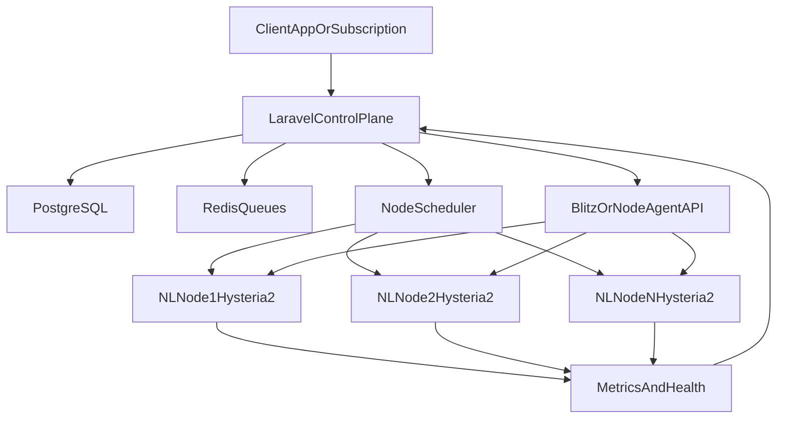

# План построения VPN-экосистемы

## Цель

Построить централизованную систему, где `Laravel` управляет пользователями, ключами, подписками, распределением по нодам, мониторингом и аварийным переключением, а `Hysteria2` на NL-серверах обслуживает трафик. Панель уровня `Blitz` можно использовать как вспомогательный исполнительный слой через API, но не как главный мозг системы.

## Ключевой архитектурный принцип

Нужно разделить систему на 3 слоя:

- `Control-plane`: центральный `Laravel`-бэкенд, который хранит пользователей, тарифы, ключи, привязки к нодам, лимиты, состояние серверов и правила перераспределения.
- `Execution-plane`: VPN-ноды с `Hysteria2`, где реально принимаются клиентские подключения и считается трафик.
- `Observability-plane`: мониторинг, алерты, health-check'и, метрики нагрузки, события падений и деградации.

## Рекомендуемая схема

- Центральный `Laravel`-сервис в отдельном защищенном контуре.
- Отдельная БД для control-plane: `PostgreSQL`.
- `Redis` для очередей, кэша, блокировок и быстрых health-state обновлений.
- Очереди `Laravel Horizon` или стандартные queue workers для асинхронных операций.
- 5-10 NL-нод с `Hysteria2`.
- На каждой ноде либо `Blitz`/его API, либо легкий node-agent, который получает команды от `Laravel`.
- Центральный Prometheus-совместимый сбор метрик и логов.
- Отдельный публичный домен для API/кабинета и отдельные домены/сабдомены для VPN endpoints.

## Что должен делать Laravel

`Laravel` должен стать источником истины для всей экосистемы:

- Управление пользователями, тарифами, сроками действия и лимитами трафика.
- Выпуск логических ключей доступа, а не жестко привязанных к одному серверу сущностей.
- Выбор оптимальной ноды при выдаче конфигурации или обновлении подписки.
- Хранение телеметрии по нодам: онлайн, CPU, RAM, UDP throughput, активные сессии, error-rate.
- Реакция на падение или перегрузку: пометить ноду как `draining` или `down`, прекратить выдачу новых клиентов на нее, перевыпустить назначение на живые ноды.
- Интеграция с панелью или агентом через API: создать пользователя, обновить лимит, заблокировать доступ, собрать статистику.

## Важное ограничение по Hysteria2

`Hysteria2` не рассчитана на прозрачный live-migration активной QUIC-сессии между серверами. Это значит:

- Нельзя бесшовно перенести уже установленное активное соединение пользователя с упавшего сервера на другой без разрыва.
- Реально достижимый сценарий: быстрый reconnect на новую ноду после обрыва или при следующем обращении клиента.
- Поэтому отказоустойчивость нужно строить вокруг `fast reassignment`, а не вокруг «магического» переноса живой сессии.

## Как правильно реализовать распределение и failover

Нужно отказаться от жесткой модели «один ключ = один сервер» на уровне control-plane.

Рекомендуемая модель:

- Пользователь получает логический доступ в системе `Laravel`.
- `Laravel` выбирает для него текущую рабочую ноду по правилам scheduler'а.
- Клиентская подписка, конфиг или API отдает актуальный endpoint для подключения.
- Если нода перегружена, новые пользователи направляются на другие ноды.
- Если нода упала, ее пользователи не сохранят текущую сессию, но после переполучения конфига или переподключения должны уйти на живую ноду.

Для этого нужны:

- Таблица состояния нод: `active`, `draining`, `degraded`, `down`.
- Scheduler в `Laravel`, который считает score ноды по загрузке и лимитам.
- Health-check сервис с коротким интервалом проверки.
- Механизм ротации назначения ноды для клиента.
- Подписки/конфиги с малым TTL или клиентский механизм регулярного обновления endpoint.

## Как распределять клиентов по серверам

На старте лучше использовать weighted scheduling:

- Каждой ноде задается вес по CPU, RAM, каналу и результатам тестов.
- При выдаче доступа `Laravel` выбирает ноду с лучшим score.
- Если нода приближается к порогу по активным сессиям, bandwidth или packet loss, она переводится в `draining`.
- Новые подключения идут на другие ноды, а старые постепенно сходят естественным образом.

Для более зрелой версии:

- Ввести отдельный scheduler-service внутри `Laravel`.
- Считать score по нескольким метрикам, а не только по числу ключей.
- Разделять heavy-users и обычных пользователей по policy.

## Как переживать падение сервера

Нормальный сценарий аварийной устойчивости будет таким:

1. Мониторинг фиксирует, что нода недоступна.
2. `Laravel` сразу помечает ее как `down`.
3. Все новые назначения уходят на живые ноды.
4. Подписки и новые конфиги начинают указывать на новую ноду.
5. Клиенты, у которых была активная сессия на упавшей ноде, теряют соединение и переподключаются уже к новой ноде.

Если нужна минимизация ручных действий:

- Делать единый subscription endpoint, который клиент периодически обновляет.
- Использовать несколько резервных endpoint'ов в клиентском профиле, если целевой клиент это поддерживает.
- Вводить `draining` заранее при признаках деградации, а не ждать полного падения.

## Можно ли спрятать ноды за единым входом

Да, но с оговорками:

- L4/UDP-балансировщик может распределять новые подключения по живым backend'ам.
- Активная QUIC-сессия все равно зависит от конкретного backend-сервера.
- Если backend упал, существующая сессия оборвется.
- Поэтому единый вход помогает для новых коннектов и операционной простоты, но не решает бесшовный live failover активной сессии.

Практически это значит:

- Можно использовать один публичный входной слой для новых соединений.
- Но основную логику отказоустойчивости все равно нужно держать в `Laravel` scheduler + health-check + subscription rotation.

## Панель или свой агент

При вашем выборе `Laravel` как главного control-plane лучше закладывать такую стратегию:

- Использовать `Blitz` только если он надежно автоматизирует локальное управление `Hysteria2` и отдает нужную статистику/API.
- Не завязывать критическую бизнес-логику на панель.
- Все важные сущности должны жить в `Laravel`: пользователь, тариф, лимит, назначение ноды, статус доступа.
- Панель или агент должны быть заменяемым слоем-исполнителем.

Практически это значит:

- Сначала проверить, хватает ли API `Blitz` для create/update/suspend user, traffic stats и health-state.
- Если API ограничен, перейти к своему node-agent на каждой ноде.

## Что нужно протестировать до продакшена

Точный ответ «сколько клиентов выдержит сервер» заранее без нагрузочных тестов никто не даст. Это зависит от:

- CPU модели и частоты.
- Ширины канала и стабильности сети.
- Реального профиля трафика пользователей.
- Настроек `Hysteria2`, MTU, QUIC, TLS и системы.

Нужно заложить обязательный capacity phase:

- Поднять 1 тестовую ноду.
- Прогнать synthetic traffic для нескольких профилей: browsing, streaming, heavy download.
- Измерить CPU, RAM, p95 latency, packet loss, throughput, количество активных сессий.
- Зафиксировать безопасный рабочий лимит не по максимуму, а с запасом 30-40%.
- На основе этих цифр назначить веса нодам.

## Этапы реализации

### Этап 1. Архитектурный фундамент

- Описать доменную модель: пользователи, подписки, ключи, ноды, назначения, usage-records, incidents.
- Выбрать базовые технологии: `Laravel`, `PostgreSQL`, `Redis`, мониторинг, логирование.
- Решить, используется ли `Blitz` как локальный исполнитель или делается свой node-agent.

### Этап 2. MVP на 2 нодах

- Поднять 2 NL-ноды с `Hysteria2`.
- Поднять центральный `Laravel`.
- Подключить API управления нодами.
- Реализовать выдачу клиента на наименее загруженную ноду.
- Собрать подписку или конфигогенератор.
- Настроить health-check и ручной failover.

### Этап 3. Production core

- Расширить до 5-10 нод.
- Внедрить метрики, алерты, incident flow.
- Включить `draining` и автоматическое снятие перегруженных нод с выдачи.
- Реализовать автоматическое переназначение пользователей для новых подключений.
- Добавить аудит действий и резервное копирование.

### Этап 4. Автоматизация и зрелость

- Внедрить scheduler по score-модели.
- Разделить тарифные политики и классы пользователей.
- Добавить self-service кабинет/API.
- Реализовать автопровижининг новых нод.
- Подготовить multi-region expansion, если NL перестанет покрывать потребности.

## Предлагаемая структура будущего проекта

- `[backend/laravel/](backend/laravel/)` — основной control-plane, API, scheduler, биллинг, пользователи, подписки.
- `[infra/terraform/](infra/terraform/)` — IaC для нод, сети, мониторинга и секретов.
- `[infra/ansible/](infra/ansible/)` — настройка `Hysteria2`, агентов и системных пакетов.
- `[agents/node-agent/](agents/node-agent/)` — если откажетесь от зависимости от панели.
- `[docs/architecture/](docs/architecture/)` — схемы, runbooks, capacity notes, failover playbooks.

## Главный практический вывод

Оптимальная схема для вашей цели: `Laravel` как единый control-plane, `Hysteria2` как data-plane на NL-нодах, панель типа `Blitz` только как заменяемый исполнительный слой, а отказоустойчивость строить через scheduler, health-check и быстрый reconnect на новую ноду. Бесшовный перенос уже активной сессии между серверами закладывать не стоит; вместо этого нужно проектировать систему так, чтобы пользователь быстро и автоматически переподключался к новой рабочей ноде.
